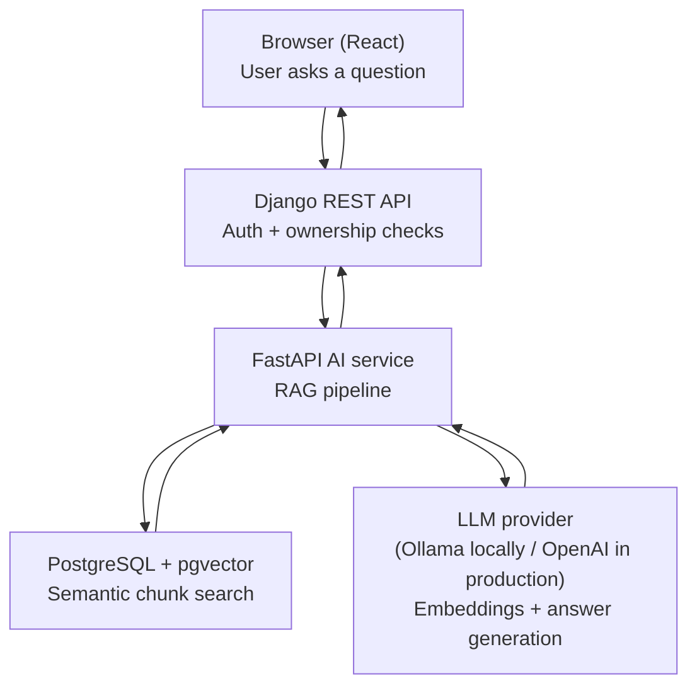

# DocuMind

An AI-powered study companion and document chat platform. Upload your documents (PDFs, notes, textbooks) and:

- 💬 **Chat with them** — ask questions and get answers grounded in your actual documents, with source citations (which file, which page)
- 🧠 **Remembers the conversation** — follow-up questions like "what about its downsides?" work correctly
- 📚 **Auto-generates study material** — a summary, a glossary of key terms, and a quiz, without you having to ask
- 🔒 **Private by design** — every user's documents and conversations are fully isolated from every other user

Built as a production-style AI SaaS project, not a tutorial demo — with a real service-oriented architecture, authentication, and per-user data isolation throughout.

---

## How it works (in plain English)

**1. You upload a document.**
The React frontend sends the file to the Django backend. Django checks it's a real PDF/TXT/DOCX under 20MB, saves it, and creates a record tied to your account.

**2. Django hands the file to the AI service.**
Django calls a separate FastAPI service internally (never exposed to your browser directly) with the file's location and your user ID. This internal call is protected by a shared secret key, so nothing outside Django can trigger it.

**3. The AI service reads and "understands" the document.**
FastAPI extracts the text, splits it into overlapping chunks (so no sentence gets awkwardly cut in half), and turns each chunk into a vector — a list of numbers that captures its *meaning* rather than its exact wording. These vectors are stored in PostgreSQL using the `pgvector` extension.

**4. You ask a question.**
The same Django → FastAPI path fires again. FastAPI turns your question into a vector too, then searches the database for the chunks whose meaning is closest to your question — filtered so it can **only ever see chunks belonging to your own account and the documents you selected.**

**5. The AI generates a grounded answer.**
Those retrieved chunks, plus your recent conversation history (so follow-up questions make sense), get sent to the language model, which is instructed to answer *only* using what's actually in your documents — and to say "I couldn't find that" rather than guess.

**6. The answer comes back with citations.**
Django saves the answer and which document/page it came from, and the frontend displays it with clickable source references.

**7. On demand, DocuMind studies the document *for* you.**
Click the 📚 icon on any processed document, and the AI service reads the whole thing and generates a short summary, a glossary of key terms, and an interactive multiple-choice quiz — turning DocuMind from a Q&A tool into an actual study companion.

---

## Architecture diagram



---

## Tech stack — and why each piece was chosen

| Layer | Technology | Why |
|---|---|---|
| Frontend | **React + Vite + Tailwind** | Needed for a genuinely interactive UI (live chat, document selection, a slide-in study panel) — much harder to build cleanly with server-rendered pages alone |
| Backend | **Django + Django REST Framework** | Handles the "product" logic: accounts, login, ownership, conversation history. Django's built-in auth and admin panel save significant boilerplate for exactly this kind of app |
| AI service | **FastAPI** | Kept deliberately separate from Django so the AI/RAG logic — which changes fast and has different dependencies — doesn't bloat or slow down the core backend. FastAPI's async support and auto-generated docs (`/docs`) suit a service that mostly calls external models and returns results |
| Database | **PostgreSQL + pgvector** | One database instead of two. Most RAG tutorials reach for a separate vector database (Pinecone, Chroma) — pgvector lets a single SQL query filter by `user_id AND document_id` *and* do similarity search at the same time, which is exactly what enforces strict per-user data isolation, with far less operational overhead than running two databases |
| Auth | **JWT (JSON Web Tokens)** | Stateless tokens mean Django doesn't need to keep server-side session state — this matters once an app runs behind a load balancer across multiple backend instances, a real production concern |
| LLM + embeddings | **Provider-agnostic (Ollama locally, OpenAI-compatible in production)** | The code talks to any OpenAI-compatible API. Right now it runs on free, local Ollama models for development; switching to a hosted provider for production is a one-line `.env` change, not a rewrite |
| Local database runtime | **Docker** | Keeps the Postgres setup reproducible and identical across machines, without installing Postgres directly on the host |

---

## Project structure

```
chat_bot/
├── frontend/          React + Vite + Tailwind
│   └── src/
│       ├── pages/       Login, Register, Dashboard
│       ├── components/  StudyPanel, etc.
│       ├── context/     Auth state
│       └── api/         Axios client (handles JWT + auto-refresh)
├── backend/           Django + DRF
│   ├── users/           Register, login, JWT
│   ├── documents/       Upload, processing status, study material
│   ├── chat/            Conversations, messages, RAG endpoint
│   ├── usage/           Usage counters (not yet enforced)
│   └── subscriptions/   Plan/limits model (not yet enforced)
├── ai-service/        FastAPI
│   └── app/
│       ├── loaders/      PDF/TXT/DOCX text extraction + chunking
│       ├── embeddings/   Turns text into vectors
│       ├── retrieval/    pgvector storage + similarity search
│       ├── llm/          LLM calls (chat answers + study material generation)
│       ├── rag/          Orchestrates the full pipeline
│       └── core/         Config, DB connection, internal auth
├── requirements.txt   Combined Python dependencies (backend + ai-service)
└── .env.example       Every environment variable the project needs, documented
```

---

## Security notes (worth knowing, worth mentioning in an interview)

- **A user can never see another user's documents or conversations** — every database query is filtered by the authenticated user's ID, never by anything the client claims about itself
- **The AI service never trusts the frontend directly** — it only accepts requests from Django, verified by an internal shared-secret key
- **File uploads are validated** by both type (PDF/TXT/DOCX only) and size (20MB max) before processing
- **Secrets never live in code** — everything sensitive (API keys, database credentials, the internal service key) comes from environment variables via `.env`, which is git-ignored

---

## Status

✅ Working MVP: auth, multi-document upload, RAG chat with citations, conversation memory, auto-generated study material (summary/glossary/quiz).

🚧 Not yet built: automated tests, background job processing for uploads, enforced usage limits/billing, production deployment.

## Setup

See the setup checklist in project notes for installing prerequisites (Python, Node.js, Docker, Ollama or an OpenAI key) and running all three services locally.
